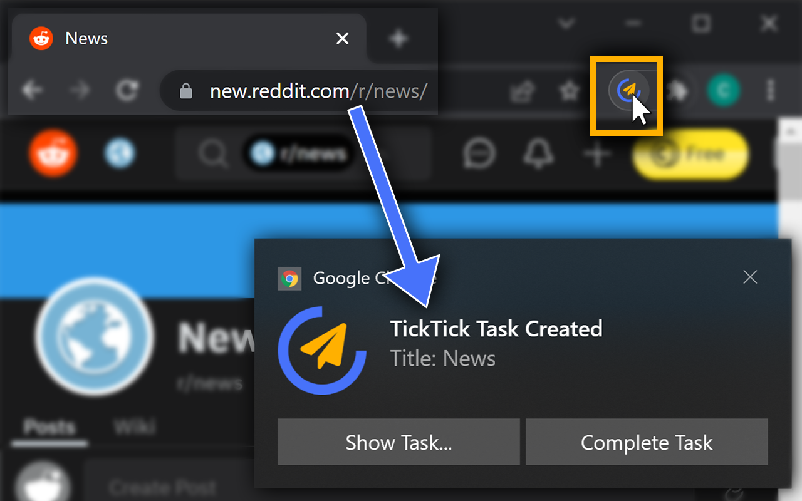
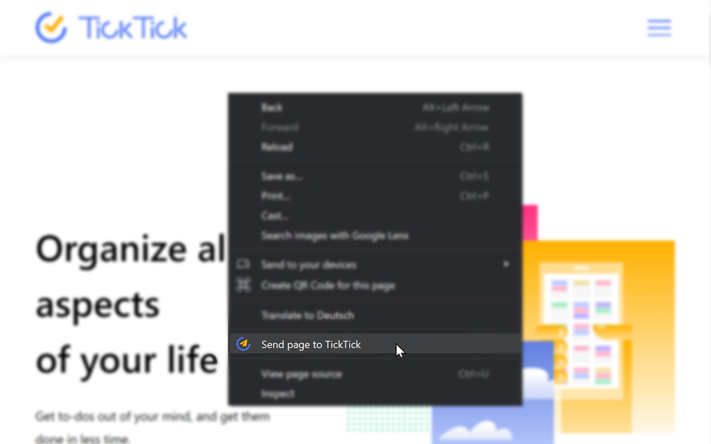
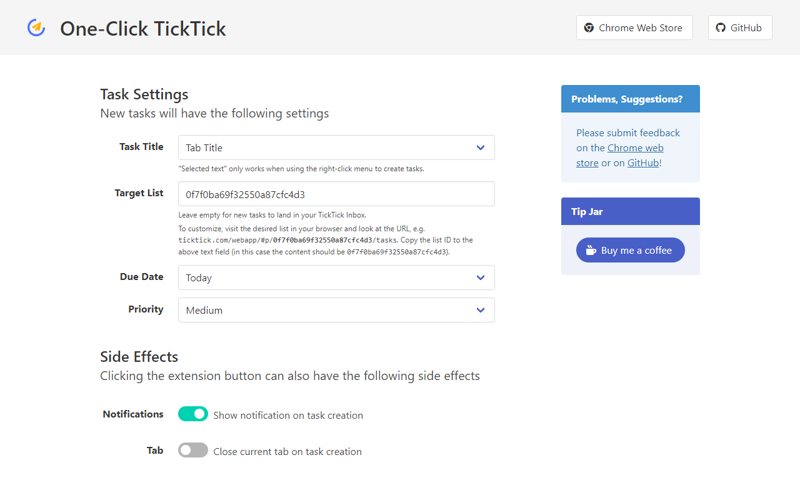

 

# One-Click TickTick

*One-Click TickTick* is an open source Chrome extension that simplifies creating a TickTick tasks from a website. It's available on the [Chrome Web Store](). 

If you frequently create TickTick tasks linking to a website you visit - maybe to visit again later or to remember something - One-Click TickTick is for you! Login once and saving a link to the current page is just one click away. 

## Installation

1. Go to the [Chrome Web Store Page]()
2. Install the extension
3. Click the extension button, which will take you to the options page, which explains the login+authentication procedure.

## About

User feedback upon clicking the extension button is immediate, even though the actual TickTick task creation can take a few seconds. Task creation is handled in the background and in the rare case of an error, the user is notified.

Several settings based on user feedback (see Chrome Store) and common use cases are available (see screenshots).

This extension is self-contained (i.e. includes all dependencies directly). It uses bulma and jQuery for the settings page, but is otherwise written in pure JavaScript with a thin wrapper around the [TickTick Open API](https://developer.ticktick.com/docs#/openapi).

### Contributing

Contributions are welcome

### Screenshots

   
    
   
    
   

